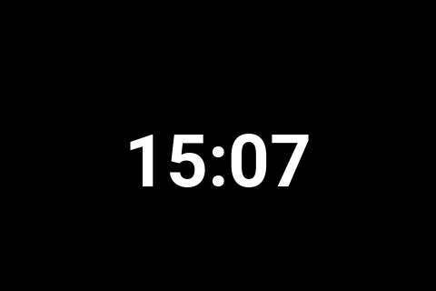
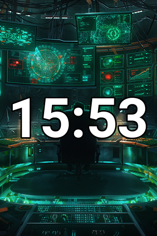

> [!WARNING]
> **This project was entirely vibecoded.** It was generated with AI assistance and has not been thoroughly reviewed, tested, or audited. Use at your own risk. There may be bugs, security issues, or things that simply don't work as described.

# macOS Notification Turing Screen

A Python app that turns a [Turing Smart Screen](https://github.com/mathoudebine/turing-smart-screen-python) into a live notification display and clock for macOS.



- **Clock** — fills the screen, updates every minute, fully customizable (font, size, color, format)
- **Notifications** — when a macOS notification arrives, the screen switches to show the app icon, app name, title, and message, then returns to the clock

## Requirements

- macOS 12 Monterey or later (tested on Sequoia)
- Python 3.10+
- A Turing Smart Screen 3.5" (Rev A) — or use simulated mode for testing without hardware
- **Full Disk Access** for the process reading notifications (see [Permissions](#permissions))

## Installation

### 1. Clone the repo

```bash
git clone --recurse-submodules https://github.com/YOUR_USERNAME/macos-notification-turing-screen.git
cd macos-notification-turing-screen
```

> `--recurse-submodules` pulls in the `turing-smart-screen-python` dependency automatically.
> If you cloned without it, run: `git submodule update --init`

### 2. Create a virtual environment and install dependencies

```bash
python3 -m venv venv
source venv/bin/activate
pip install -r requirements.txt
```

### 3. Permissions

The notification listener reads the macOS notification database at:
`~/Library/Group Containers/group.com.apple.usernoted/db2/db`

Grant **Full Disk Access** to whichever process will run the app:

- **Running manually in a terminal**: grant FDA to your terminal app (Terminal, iTerm2, Warp, etc.)
- **Running as a LaunchAgent**: grant FDA to the venv Python binary (`venv/bin/python3`)

Open **System Settings → Privacy & Security → Full Disk Access**, click `+`, and add the relevant app or binary.

### 4. Connect the Turing screen

Plug in the screen via USB, then find its serial port:

```bash
ls /dev/cu.*
```

Look for something like `/dev/cu.usbmodemXXXX` or `/dev/cu.usbserialXXXX`.

### 5. Configure

Copy and edit the config:

```bash
cp config.yaml config.local.yaml   # optional: keep local changes out of git
# or just edit config.yaml directly
```

Minimum changes needed:

```yaml
display:
  revision: "A"                            # "A" for Turing 3.5", "SIMU" to test without hardware
  com_port: "/dev/cu.usbmodemXXXX"         # your port from step 4, or "AUTO"
  orientation: 270                         # 0=portrait, 90=landscape, 180=reverse portrait, 270=reverse landscape
```

### 6. Run

```bash
source venv/bin/activate
python3 main.py
```

Press `Ctrl+C` to stop.

## Testing Without Hardware

Set `display.revision: "SIMU"` in `config.yaml`. A window will open showing the simulated screen.

To trigger a test notification:

```bash
osascript -e 'display notification "Hello from Turing!" with title "Test App" subtitle "Works!"'
```

Expect 5–10 seconds of latency — macOS buffers writes to the notification database before flushing.

## Configuration Reference

All settings live in `config.yaml`.

### `display`

| Key | Default | Description |
|-----|---------|-------------|
| `revision` | `"SIMU"` | `"A"` for Turing 3.5", `"SIMU"` for simulated |
| `com_port` | `"AUTO"` | Serial port or `"AUTO"` |
| `width` | `320` | Display width in pixels |
| `height` | `480` | Display height in pixels |
| `orientation` | `"PORTRAIT"` | `0`/`"PORTRAIT"`, `90`/`"LANDSCAPE"`, `180`/`"REVERSE_PORTRAIT"`, `270`/`"REVERSE_LANDSCAPE"` |
| `brightness` | `50` | Brightness 0–100 |

### `clock`

| Key | Default | Description |
|-----|---------|-------------|
| `font` | Roboto Bold | Path to a TTF font (relative to this folder) |
| `font_size` | `0` | Font size in px — `0` auto-fits to fill the screen |
| `color` | `"#FFFFFF"` | Text color (hex, named color, or `[R, G, B]`) |
| `background_color` | `"#000000"` | Background color (used when no `background_image` is set) |
| `background_image` | _(none)_ | Path to a background image — overrides `background_color`. Scaled to fit the screen. |
| `format` | `"%H:%M"` | [strftime](https://strftime.org) format — e.g. `"%H:%M:%S"` to include seconds |
| `position` | `"center"` | `"center"`, `"top"`, or `"bottom"` |
| `stroke_width` | `0` | Outline thickness in pixels around the clock digits (`0` = disabled) |
| `stroke_color` | `"#000000"` | Outline color — useful for readability over background images |

### `notifications`

| Key | Default | Description |
|-----|---------|-------------|
| `display_duration` | `8` | Seconds to show a notification before returning to the clock |
| `icon_size` | `64` | App icon size in pixels |
| `font` | Roboto Bold | Path to a TTF font |
| `title_font_size` | `20` | Title font size |
| `body_font_size` | `16` | Body text font size |
| `text_color` | `"#FFFFFF"` | Text color |
| `background_color` | `"#1a1a2e"` | Background color (used when no `background_image` is set) |
| `background_image` | _(none)_ | Path to a background image — overrides `background_color`. Scaled to fit the screen. |

The submodule ships ready-made backgrounds sized for Turing screens:

```yaml
clock:
  background_image: "turing-smart-screen-python/res/backgrounds/example_320x480.png"
```



## Running at Login (Background Service)

Use a macOS **LaunchAgent** to start the app automatically at login.

### 1. Find your paths

```bash
# venv python
echo "$(pwd)/venv/bin/python3"

# main.py
echo "$(pwd)/main.py"
```

### 2. Create the plist

Save as `~/Library/LaunchAgents/com.local.turing-notifier.plist`:

```xml
<?xml version="1.0" encoding="UTF-8"?>
<!DOCTYPE plist PUBLIC "-//Apple//DTD PLIST 1.0//EN"
  "http://www.apple.com/DTDs/PropertyList-1.0.dtd">
<plist version="1.0">
<dict>
    <key>Label</key>
    <string>com.local.turing-notifier</string>

    <key>ProgramArguments</key>
    <array>
        <string>/ABSOLUTE/PATH/TO/venv/bin/python3</string>
        <string>/ABSOLUTE/PATH/TO/main.py</string>
    </array>

    <key>RunAtLoad</key>
    <true/>

    <key>KeepAlive</key>
    <true/>

    <!-- Wait 30s before restarting (avoids tight loop when screen is unplugged) -->
    <key>ThrottleInterval</key>
    <integer>30</integer>

    <key>StandardOutPath</key>
    <string>/tmp/turing-notifier.log</string>
    <key>StandardErrorPath</key>
    <string>/tmp/turing-notifier.err</string>
</dict>
</plist>
```

### 3. Load it

```bash
launchctl load ~/Library/LaunchAgents/com.local.turing-notifier.plist
```

### Manage the service

```bash
launchctl stop com.local.turing-notifier       # stop
launchctl start com.local.turing-notifier      # start
launchctl unload ~/Library/LaunchAgents/com.local.turing-notifier.plist  # disable autostart

tail -f /tmp/turing-notifier.log               # view logs
tail -f /tmp/turing-notifier.err               # view errors
```

> When running as a LaunchAgent, grant **Full Disk Access** to `venv/bin/python3` (not your terminal).

## How Notifications Work

macOS provides no public API for receiving other apps' notifications. This app monitors the notification SQLite database (`~/Library/Group Containers/group.com.apple.usernoted/db2/db`) using `kqueue` — a kernel-level file-change event, so there is no polling overhead.

**Expected latency**: 5–10 seconds. macOS (`usernoted`) buffers notifications in memory before flushing to disk, which is when the watcher triggers.

## Troubleshooting

**No notifications appearing**
→ Make sure Full Disk Access is granted (see [Permissions](#permissions)).

**`PermissionError` opening the notification database**
→ Same as above.

**Screen not detected / serial error**
→ Run `ls /dev/cu.*` to find the port and set `com_port` explicitly.
→ Make sure no other app (e.g. the official Turing software) has the port open.
→ If running as a LaunchAgent, the app will exit and `launchd` will restart it every 30 seconds until the screen is plugged back in.

**`ModuleNotFoundError: No module named 'library'`**
→ The `turing-smart-screen-python/` submodule is missing. Run: `git submodule update --init`

**`ModuleNotFoundError: No module named 'numpy'` (or other dependencies)**
→ Run: `pip install -r requirements.txt`

## Project Structure

```
macos-notification-turing-screen/
├── main.py                      # Entry point
├── config.py                    # Config loader
├── config.yaml                  # Default settings (safe to commit)
├── config.local.yaml            # Local overrides — gitignored, takes precedence over config.yaml
├── renderer.py                  # PIL-based screen rendering
├── notification_listener.py     # macOS notification watcher (kqueue + SQLite)
├── requirements.txt
├── CLAUDE.md                    # Developer notes
└── turing-smart-screen-python/  # Git submodule
```

## License

[Apache License 2.0](LICENSE)

## Credits

- [turing-smart-screen-python](https://github.com/mathoudebine/turing-smart-screen-python) by mathoudebine — display driver
